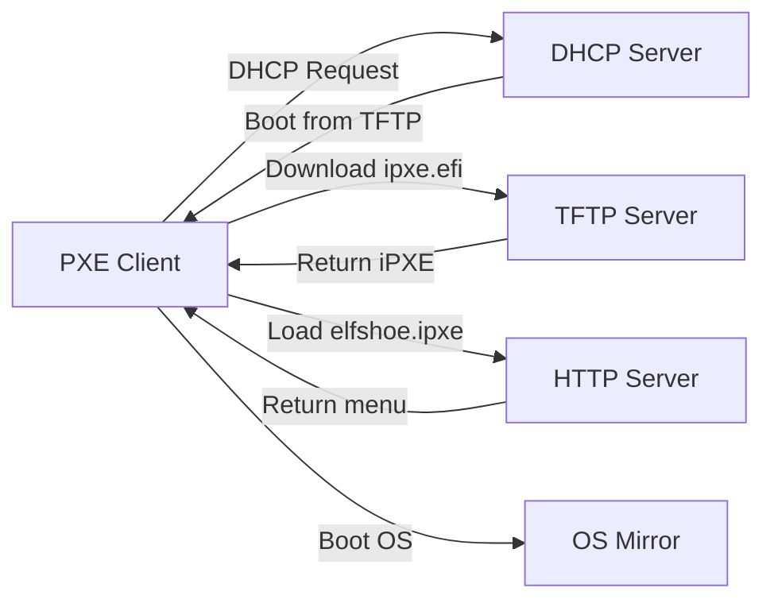

# Server Setup Guide

This guide walks you through setting up the complete network boot infrastructure to use this iPXE menu.

## Overview

Network booting with iPXE requires three components:

1. **DHCP Server** - Directs clients to the TFTP server and boot files
2. **TFTP Server** - Serves iPXE boot loaders (ipxe.pxe, ipxe.efi)
3. **HTTP Server** - This site! Or your own mirror of elfshoe.ipxe



## Step 1: Get iPXE Boot Files

Download pre-built iPXE binaries from the official iPXE project:

!!! example "Copy these commands"

    ```bash
    sudo mkdir -p /tftpboot
    sudo wget https://boot.ipxe.org/ipxe.pxe -O /tftpboot/ipxe.pxe
    sudo wget https://boot.ipxe.org/x86_64-efi/ipxe.efi -O /tftpboot/ipxe.efi
    sudo wget https://boot.ipxe.org/arm64-efi/ipxe.efi -O /tftpboot/ipxe-arm64.efi
    sudo chmod 644 /tftpboot/*
    ```

!!! info "Other architectures"
    Additional architectures are available at [https://boot.ipxe.org/](https://boot.ipxe.org/) including arm32-efi, i386-efi, riscv64-efi, and loong64-efi.

## Step 2: Install and Configure dnsmasq

dnsmasq combines DHCP and TFTP in one lightweight daemon - perfect for simple setups.

### Install dnsmasq

=== "Debian/Ubuntu"
    ```bash
    sudo apt update
    sudo apt install dnsmasq
    ```

=== "RHEL/CentOS/Fedora"
    ```bash
    sudo dnf install dnsmasq
    ```

### Configure dnsmasq

Create `/etc/dnsmasq.d/pxe-boot.conf`:

```ini
# Enable TFTP server
enable-tftp
tftp-root=/tftpboot

# Match all PXE clients
dhcp-match=set:pxe,60,PXEClient

# Set tag based on client architecture
dhcp-match=set:bios,option:client-arch,0
dhcp-match=set:efi-x86_64,option:client-arch,7
dhcp-match=set:efi-x86_64,option:client-arch,9
dhcp-match=set:efi-arm64,option:client-arch,11

# Detect iPXE (for chain loading)
dhcp-match=set:ipxe,175

# First stage: Load iPXE bootloader
dhcp-boot=tag:bios,tag:!ipxe,ipxe.pxe
dhcp-boot=tag:efi-x86_64,tag:!ipxe,ipxe.efi
dhcp-boot=tag:efi-arm64,tag:!ipxe,ipxe-arm64.efi

# Second stage: Chain to elfshoe menu via HTTP
dhcp-boot=tag:ipxe,chain.ipxe

# Enable DHCP logging (optional)
log-dhcp
```

### Create Chain Loader

Create `/tftpboot/chain.ipxe` to load the menu from this site via HTTP:

```ipxe
#!ipxe

# Chain to elfshoe menu via HTTP (faster than TFTP)
chain https://timhughes.github.io/ipxe/elfshoe.ipxe || shell
```

!!! tip "Use your own domain"
    Replace `https://timhughes.github.io/ipxe/` with your own domain if you're hosting the menu yourself.

### Start dnsmasq

```bash
sudo systemctl restart dnsmasq
sudo systemctl enable dnsmasq
```

## Step 3: Configure Firewall

Open required ports:

=== "UFW (Ubuntu/Debian)"
    ```bash
    sudo ufw allow 67/udp   # DHCP
    sudo ufw allow 69/udp   # TFTP
    ```

=== "firewalld (RHEL/Fedora)"
    ```bash
    sudo firewall-cmd --permanent --add-service=dhcp
    sudo firewall-cmd --permanent --add-service=tftp
    sudo firewall-cmd --reload
    ```

=== "iptables"
    ```bash
    sudo iptables -A INPUT -p udp --dport 67 -j ACCEPT
    sudo iptables -A INPUT -p udp --dport 69 -j ACCEPT
    ```

## Step 4: Test Your Setup

### Test TFTP Server

From another machine on the same network:

```bash
tftp YOUR_SERVER_IP
tftp> get ipxe.efi
tftp> quit

# Verify file was downloaded
ls -lh ipxe.efi
```

### Test PXE Boot

1. Boot a VM or physical machine with network boot enabled in BIOS/UEFI
2. Watch the boot process:
   - Client gets IP from DHCP
   - Downloads `ipxe.efi` via TFTP
   - iPXE loads and fetches `elfshoe.ipxe` via HTTP
   - The boot menu appears!

### Debug with iPXE Shell

If boot fails, press ++ctrl+b++ during iPXE boot to enter the shell:

```ipxe
# Check network configuration
dhcp
ifstat

# Test HTTP access
chain https://timhughes.github.io/ipxe/elfshoe.ipxe

# Or drop to shell for debugging
shell
```

## Advanced: Embedded Script (Recommended for Production)

For production deployments, embed the chain command directly into the iPXE bootloader to eliminate the chain.ipxe file:

```bash
# Create embed script
cat > embed.ipxe << 'EOF'
#!ipxe
chain https://timhughes.github.io/ipxe/elfshoe.ipxe || shell
EOF

# Build iPXE with embedded script
cd ipxe/src
make bin-x86_64-efi/ipxe.efi EMBED=../../embed.ipxe

# Copy to TFTP directory
sudo cp bin-x86_64-efi/ipxe.efi /tftpboot/
```

Then update dnsmasq to skip the chain loader:

```ini
# Remove the chain.ipxe line, iPXE will auto-load the embedded script
dhcp-boot=tag:bios,tag:!ipxe,ipxe.pxe
dhcp-boot=tag:efi-x86_64,tag:!ipxe,ipxe.efi
```

## Alternative DHCP Servers

### ISC DHCP Server

If you're already using ISC DHCP:

```conf
# /etc/dhcp/dhcpd.conf
option architecture-type code 93 = unsigned integer 16;

subnet 192.168.1.0 netmask 255.255.255.0 {
    range 192.168.1.100 192.168.1.200;
    option routers 192.168.1.1;
    option domain-name-servers 8.8.8.8;
    
    next-server 192.168.1.10;  # TFTP server IP
    
    if option architecture-type = 00:00 {
        filename "ipxe.pxe";  # BIOS
    } elsif option architecture-type = 00:07 {
        filename "ipxe.efi";  # UEFI x86_64
    } elsif option architecture-type = 00:09 {
        filename "ipxe.efi";  # UEFI x86_64 alternative
    } elsif option architecture-type = 00:0b {
        filename "ipxe-arm64.efi";  # UEFI ARM64
    }
}
```

### Standalone TFTP (tftpd-hpa)

If you want a separate TFTP server:

```bash
# Install
sudo apt install tftpd-hpa  # Debian/Ubuntu
sudo dnf install tftp-server  # RHEL/Fedora

# Configure /etc/default/tftpd-hpa
TFTP_USERNAME="tftp"
TFTP_DIRECTORY="/tftpboot"
TFTP_ADDRESS="0.0.0.0:69"
TFTP_OPTIONS="--secure"

# Start
sudo systemctl restart tftpd-hpa
sudo systemctl enable tftpd-hpa
```

## Troubleshooting

### Client gets IP but doesn't boot

- Check DHCP next-server and filename options
- Verify TFTP server is running: `sudo systemctl status dnsmasq`
- Check firewall allows UDP port 69

### "Connection timed out" when loading menu

- Verify HTTP access from client network: `curl https://timhughes.github.io/ipxe/elfshoe.ipxe`
- Check client has internet access or mirror the menu locally
- Test with `chain http://` instead of `https://` to rule out SSL issues

### Wrong architecture shown in menu

- Verify iPXE is detecting architecture correctly (press ++ctrl+b++, then type `show buildarch`)
- Check your boot file matches client architecture (x86_64 needs x86_64-efi/ipxe.efi)

## References

- **iPXE Project**: [https://ipxe.org/](https://ipxe.org/)
- **iPXE Downloads**: [https://boot.ipxe.org/](https://boot.ipxe.org/)
- **elfshoe Documentation**: [https://timhughes.github.io/elfshoe/](https://timhughes.github.io/elfshoe/)
- **dnsmasq Documentation**: [http://www.thekelleys.org.uk/dnsmasq/doc.html](http://www.thekelleys.org.uk/dnsmasq/doc.html)
